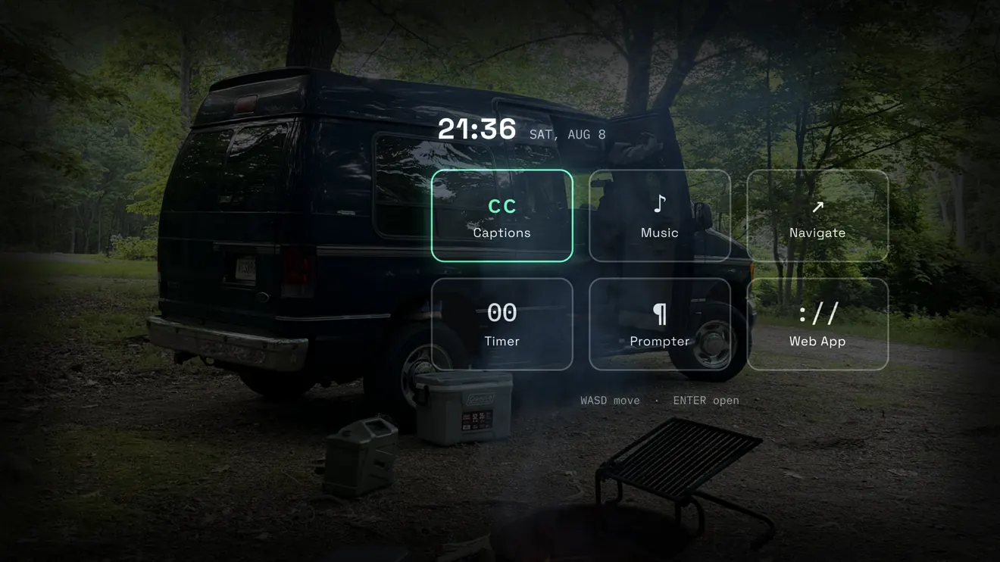
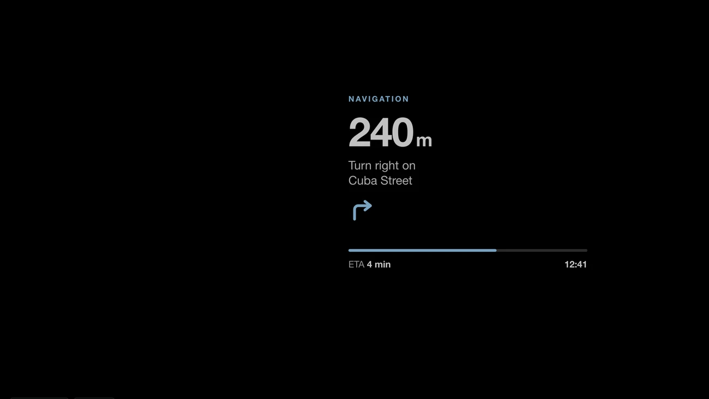
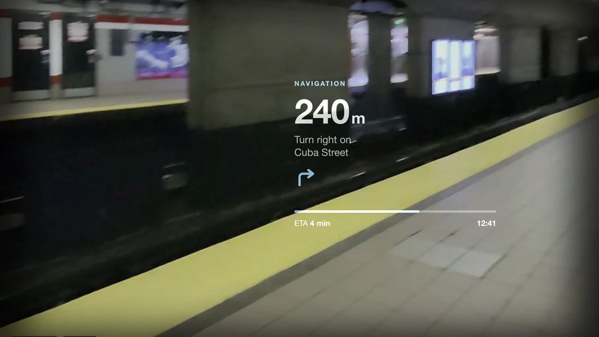
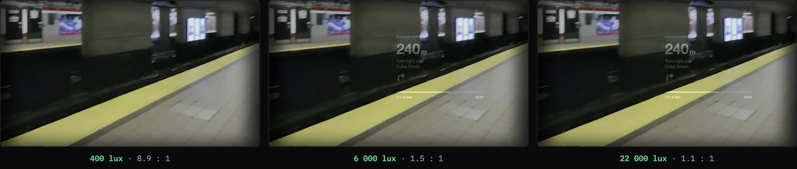

# WASD

**W**eb **A**pps **S**imulator for **D**isplay.

Preview any web app the way it looks on the display of Meta Ray-Ban Display glasses. In the browser, no hardware.

[**wasd.tools**](https://wasd.tools/) &middot; [one minute of it in use](https://youtube.com/shorts/5pBoF9u8kD0) &middot; [discussion on r/MetaRayBanDisplay](https://www.reddit.com/r/MetaRayBanDisplay/comments/1vjsqmv/three_months_of_daily_rayban_display_wear_taught/)



## Why it exists

I wore a pair of Meta Ray-Ban Display glasses daily for three months and built a set of apps on them. The ideas were never the bottleneck. The loop was: to find out whether a layout actually reads, you have to put it on the glasses, walk outside, and squint at it. That is a miserable feedback cycle when you are arguing with yourself about type sizes.

So this is the tool I wanted. It replays a design in a specific place and lighting condition, then records it, which matters as much as the preview does. I work in academia, and being able to hand someone a video of exactly what a wearer sees is often worth more than describing it.

Every background clip was shot on the glasses themselves over those three months, on the east and west coasts of the US. That is why the framing sits at a wearer's height rather than a phone's.

The optical reason any of this is necessary: a waveguide display *adds* light to the world. Pure black emits nothing, so it renders as clear glass, and dark text disappears entirely. Most web apps ported to glasses are unreadable in daylight for exactly this reason.

WASD composites your app with `mix-blend-mode: plus-lighter` over that footage, so you see the problem in about five seconds.

| What you design | What the wearer sees |
| --- | --- |
|  |  |

Raise the ambient level and watch the same design stop working:



## Features

- **In-lens launcher.** The display runs a small keyboard-driven OS: six apps, moved through with W A S D or the arrows, ENTER to open, ESC for home.
- **Any URL.** Load your own app into the Web App slot; it stays live and interactive inside the panel.
- **Create in place.** Describe an app at [wasd.tools/create](https://wasd.tools/create) and it is generated straight into the lens: single file, tuned for additive optics, refinable by chat, shareable as a link that carries the whole app. Free tier included, or bring your own DeepSeek key.
- **Real optics.** Display luminance (300 to 2000 nits) and ambient illuminance (50 to 30 000 lux) as separate quantities, with the additive contrast ratio they produce. Usable above 3:1, marginal down to 1.5:1, lost below that.
- **20 scenes**, plus anything you drop in or link to, with darkness, blur, and a choice of filling the view or showing the whole frame as shot.
- **Capture and record** in two framings: 16:9 point of view, or 1:1 like the glasses' own recorder.
- **QR handoff** to open an app on real glasses, and deep links that restore the whole setup.

## Running it

Static apart from one serverless function. No build step, no dependencies.

```bash
python3 -m http.server 8000
# then open http://localhost:8000
```

The framing pre-flight (`api/can-frame.js`) needs Vercel. Without it the app simply frames the URL as before.

## Layout

```
index.html    Shell: stage on the left, control panel on the right
wasd.css      Tokens and component styles
wasd.js       Device profiles, optics, launcher, capture, deep links
create.html   Describe an app, see it in the lens, refine by chat
create.js     Generation client, revisions, simulator bridge
codec.js      gzip + base64url codec for apps that travel inside links
api/          Serverless: framing pre-flight, DeepSeek generator
demos/        Self-hosted demo apps
background/   Scene clips and their poster frames
docs/         Single-page documentation
```

## Other devices

The simulation is Meta Ray-Ban Display because that is the pair I wear, but the
device itself is one object in `wasd.js`: panel grid, field of view, which eye,
luminance range, and the shape the built-in recorder exports. Add an entry, load
`?device=your-key`, and the geometry, the angular readout, the brightness range and
the capture framing all follow from it.

If you own something else, that object plus a few clips shot on your own hardware is
the whole contribution. [`CONTRIBUTING.md`](CONTRIBUTING.md) says what each number is
and where to find it.

## Notes

The scenes are original footage shot on Ray-Ban Meta glasses. The one third-party dependency is `vendor/qrcode.min.js` (MIT). Google Fonts is the only external request at runtime.

A blocked iframe cannot be detected from the page: browsers make a blocked frame indistinguishable from a working cross-origin one. That is why the framing check reads the response headers server-side.

Working notes and roadmap: [`IMPROVEMENTS.md`](IMPROVEMENTS.md).

## License

MIT. See [LICENSE](LICENSE).
